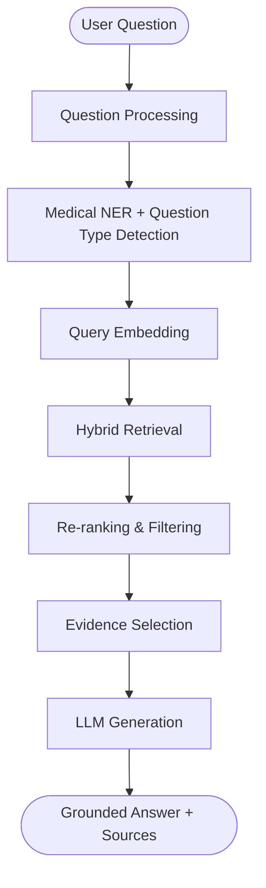

# Medical Q&A Chatbot

A complete Medical Question Answering Chatbot using the MedQuAD Dataset and a local Streamlit web application. This system uses Retrieval-Augmented Generation (RAG) to retrieve relevant medical information from the MedQuAD dataset and provides grounded answers to user questions.

## Architecture



## Features
- **Medical Entity Extraction**: Uses SpaCy to extract diseases, symptoms, and treatments.
- **Context-Aware**: Remembers the recent topic and can resolve pronouns (e.g. "What are its symptoms?").
- **Semantic Retrieval**: Uses `sentence-transformers` and ChromaDB to find the most relevant MedQuAD records.
- **Grounded Answers**: The LLM relies solely on retrieved evidence.
- **Source Display**: All answers include the exact source text and relevance score.

## Installation

1. Create a virtual environment and install dependencies:
```bash
python -m venv venv
venv\\Scripts\\activate
pip install -r requirements.txt
```

2. Download SpaCy model:
```bash
python -m spacy download en_core_web_sm
```

## Dataset Setup
Run the download script to fetch MedQuAD and the prepare script to process it:
```bash
python scripts/download_data.py
python scripts/prepare_data.py
```

## Index Creation
Build the vector index (ChromaDB):
```bash
python scripts/build_index.py
```

## Running the Application
```bash
streamlit run app.py
```

## Limitations
- **No Diagnostic Capability:** This is an informational tool and does not provide diagnosis.
- **Dataset Coverage:** The bot only knows what is in the MedQuAD dataset. 
- **Mock LLM:** By default, it uses a mock LLM that aggregates the retrieved answers. You can integrate a real LLM via Groq, OpenAI, or Hugging Face in `models/llm.py`.

## Citation
The MedQuAD dataset is provided by:
A. Ben Abacha and D. Demner-Fushman, "A Question-Entailment Approach to Question Answering", BMC Bioinformatics, 2019.
[MedQuAD GitHub Repository](https://github.com/abachaa/MedQuAD)
