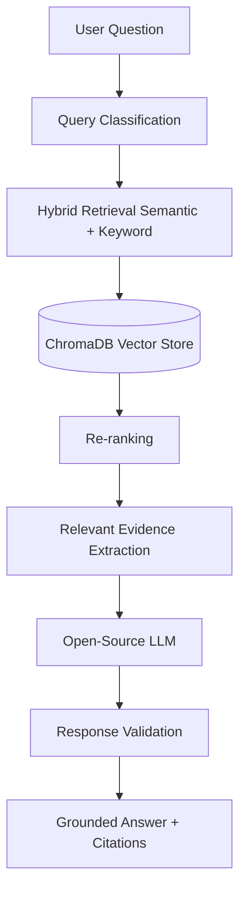

# Scientific Research Domain Expert Chatbot

A complete domain expert chatbot using the arXiv dataset, tailored for Computer Science research. This system implements a robust Retrieval-Augmented Generation (RAG) architecture, capable of searching scientific papers, explaining concepts, comparing research, and maintaining conversation context.

## Problem Statement
Navigating the massive volume of scientific research published on arXiv is challenging. Researchers often need to synthesize information across multiple papers, understand complex methodologies, and trace the evolution of concepts. A generic chatbot often hallucinates or provides shallow explanations. This project solves this by grounding an LLM strictly in retrieved arXiv metadata and abstracts, providing a reliable, citation-backed research assistant.

## Architecture


## Technology Stack
*   **Frontend**: Streamlit (Multi-tab interface)
*   **Vector Database**: ChromaDB (persistent local storage)
*   **Embeddings**: SentenceTransformers (`all-MiniLM-L6-v2`)
*   **LLM Framework**: LangChain (for modularity)
*   **LLM**: Pluggable Open-Source LLM (default set to Ollama for local, or any LangChain-supported API)
*   **Visualization**: PyVis (Concept Graphs), Plotly (Timelines)
*   **Data Processing**: Pandas, Python generator-based JSON parsing (to prevent memory overflow)

## Installation

1.  **Clone the repository & enter the directory**
2.  **Create a virtual environment**:
    ```bash
    python -m venv venv
    venv\Scripts\activate  # Windows
    source venv/bin/activate  # Mac/Linux
    ```
3.  **Install requirements**:
    ```bash
    pip install -r requirements.txt
    ```
4.  **Environment Variables**:
    Copy `.env.example` to `.env` and fill in your details (LLM config, Kaggle keys).

## Dataset Preparation
This project uses the `Cornell-University/arxiv` dataset from Kaggle.
1. Run the download script to fetch the raw data:
   ```bash
   python scripts/download_data.py
   ```
2. Filter the dataset for Computer Science categories (cs.AI, cs.LG, etc.):
   ```bash
   python scripts/prepare_data.py
   ```

## Index Creation
Build the vector index (ChromaDB) for semantic search. This processes the filtered CS papers, generating embeddings for their titles and abstracts.
```bash
python scripts/build_index.py
```

## Running the Application
Once the data is processed and indexed, start the Streamlit app:
```bash
streamlit run app.py
```

## Evaluation
The project includes static test cases to evaluate retrieval (Recall@K, Precision@K) and answer quality (hallucination checks, groundedness).
```bash
python -m evaluation.retrieval_metrics
```

## Limitations
*   **Abstract-Only Data**: The base Kaggle dataset primarily contains metadata and abstracts, not full PDFs. The chatbot's knowledge is limited to what's in the abstract.
*   **LLM Errors**: Explanations are generated by an LLM and may contain reasoning errors, even when grounded in retrieved text. Always verify citations.
*   **Quality vs. Relevance**: Retrieval scores indicate semantic similarity to the query, not necessarily the scientific quality or impact of the paper.
