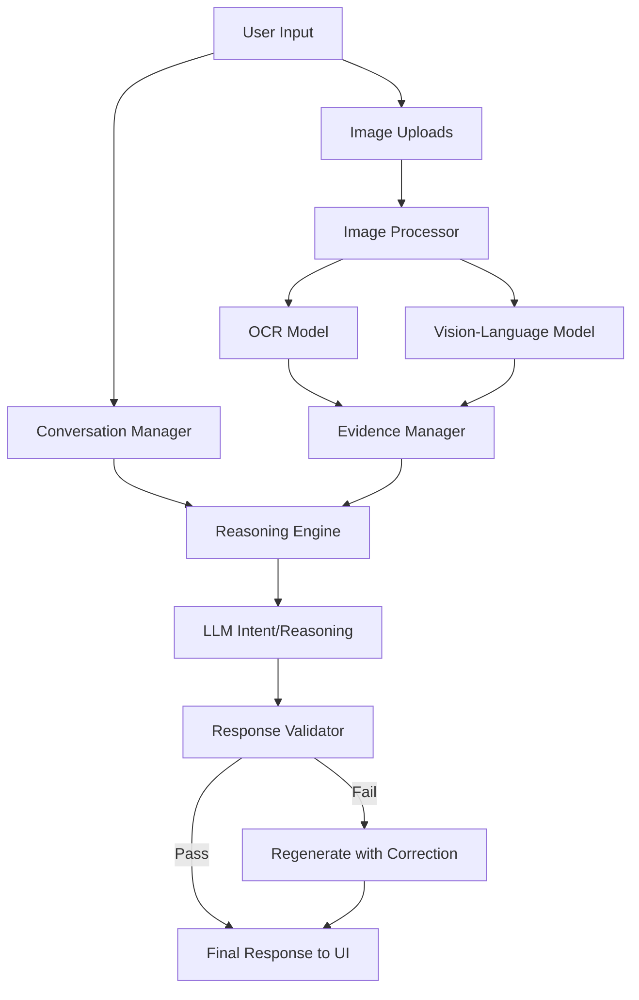

# Multimodal AI Assistant

## Problem Statement
Standard vision-language models typically act as direct QA systems for images. They do not maintain conversational context well, lack structural evidence extraction, struggle to handle ambiguous queries gracefully, and often hallucinate when evidence is insufficient. This project builds a **Multimodal AI Assistant** that operates on a structured reasoning pipeline to solve these issues.

## Project Objective
Develop a multimodal AI assistant capable of understanding both text and images, combining information, extracting structured visual evidence, maintaining context across multiple turns, handling ambiguity, and validating its own responses before displaying them to the user.

## Features
- **Visual Information Extraction**: Extracts objects, text (via OCR), and summaries before reasoning.
- **Evidence-Based Reasoning**: Separates observations from conclusions.
- **Conversational Memory**: Remembers older images and context.
- **Image Reference Resolution**: Understands terms like "this image", "the chart", "the previous picture".
- **Ambiguity Handling**: Asks for clarification instead of guessing blindly.
- **Response Validation**: Secondary LLM pass prevents hallucinations by checking the final response against the extracted evidence.

## Architecture & Data Flow



## Technology Stack
- **Frontend**: Streamlit
- **Vision-Language & Reasoning Models**: `google-genai` (Gemini 2.5 Flash / Pro). Chosen for its excellent multimodal reasoning capabilities and practical inference endpoint, allowing the system to run on standard hardware without requiring massive local GPUs.
- **OCR Engine**: EasyOCR (pure Python, excellent multi-language support, isolates pure text extraction from LLM interpretation).
- **Image Processing**: Pillow (PIL)

## Installation Instructions

1. **Clone the repository** (or download the files).
2. **Install dependencies**:
   ```bash
   pip install -r requirements.txt
   ```
3. **Environment Setup**:
   Copy `.env.example` to `.env` and add your Gemini API Key.
   ```
   GEMINI_API_KEY=your_actual_key_here
   ```

## How to Run
Start the Streamlit application:
```bash
streamlit run app.py
```

## Supported Image Formats
PNG, JPG, JPEG, WEBP (Max size: 10MB per image).

## Component Design
### Conversation Memory Design
Maintains a sliding window of recent conversation turns and tracks which Image IDs were uploaded in which turn.

### Evidence Extraction
Images are passed to the OCR model to get raw text, and to the Vision Model to get a structured JSON summary (objects, regions, confidence, unclear flags). This evidence is stored with a unique ID.

### Reasoning Pipeline
1. **Intent Analysis**: The LLM determines if the query is a follow-up, a comparison, or ambiguous. It resolves image references (e.g., "first image" -> img_id_1).
2. **Response Generation**: The LLM is provided ONLY with the formatted evidence text (not the raw image again) and asked to generate an answer.

### Ambiguity Handling
If the intent analyzer detects a vague question ("Which is better?"), it short-circuits the generation step and asks the user for clarification.

### Response Validation
A validation prompt compares the generated answer against the evidence text. If it hallucinates or fails to address the query, a regeneration is triggered.

## Evaluation Methodology
Run tests using:
```bash
python -m pytest evaluation/
```
The test suite validates logic flows (Mocking the LLM) for Ambiguity, Validation, Context Retention, and Image Reference Resolution.

## Known Limitations
- The current implementation relies on an external API (`google-genai`) for reasoning and vision tasks. To run entirely locally, the LLM module needs to be swapped out for `transformers` with a model like Qwen2.5-VL (which requires significant VRAM).
- EasyOCR can be slow on the first run as it downloads language models.

## Future Improvements
- Add persistent Vector DB (ChromaDB) for long-term memory spanning weeks.
- Implement an explicit local-only model wrapper (e.g. `llama.cpp` or `vLLM` integration).
